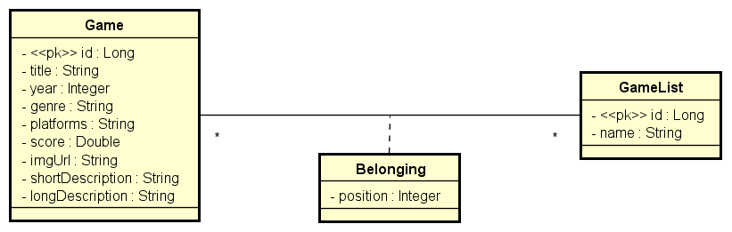

# MyGameList
This is a copy of  myAnimeList, but with games

## This is a study project

- ### Concepts 
    - Web Systems and resources
    - Client/Server, HTTP, JSON
    - Rest pattern for web API 
- Spring Rest project structuring
- ORM (Object Relational Mapping) and entities
- DataBase seeding
- Layers Pattern
- Controller, Service and repository
- DTO pattern
- N-N relationship
- Association Class, embedded id
- SQL consults in Spring Data JPA
- Projections

** Concept Model **

