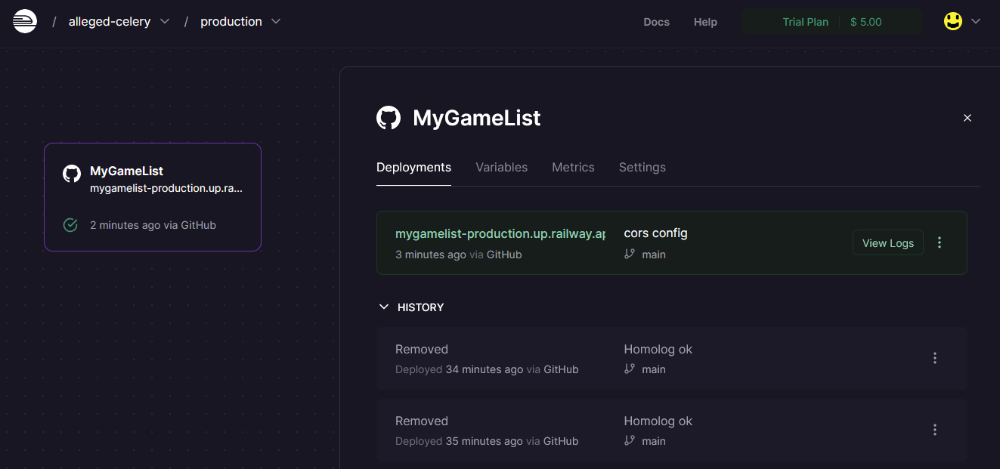

# MyGameList
This is a copy of  myAnimeList, but with games

## This is a study project

## Lesson 1 
- ### Concepts 
    - Web Systems and resources
    - Client/Server, HTTP, JSON
    - Rest pattern for web API 
- Spring Rest project structuring
- ORM (Object Relational Mapping) and entities
- DataBase seeding
- Layers Pattern
- Controller, Service and repository
- DTO pattern
## Lesson 2
- N-N relationship
- Association Class, embedded id
- SQL consults in Spring Data JPA
- Projections
## Lesson 3
- portfolio tips 
- project profiles (test, developer, production/deployment)
- Local Environment with docker composer
- local homologation process
- deploy with Cl/CD
- CORS Configuration
## Lesson 4
- Design and endpoints implementations
- HTTP verbs

** Concept Model **

** In Railway **

